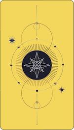

# Tarotly Tarot App - (https://tarotly-react.vercel.app/)
¡Haciendo una divertida aplicación de tarot!  

## Built with:

## Description:

### Links
[Acerca de esta Apliacion](./docs/about.md)  
[Instrucciones](./docs/ReadingTheCards.md)

# About Me:

- 🤔 I’m looking for better oportunities and projects to growth my skills and gain experience.
- ⚡ Fun fact: I play video games, play the guitar/sing and learn new technologies very often.
- 🔭 My Portfolio:https://brealy-padron-portfolio-react.vercel.app/

:mailbox: Reach me out!
- 📫 How to reach me: neighbordevcr@gmail.com

